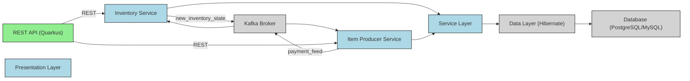

# Microservices Architecture - Quarkus, Kafka & Hibernate

## Overview
This diagram represents a **Java microservices architecture** using **Quarkus** for REST APIs, **Kafka** for asynchronous messaging, and **Hibernate** for database persistence.

